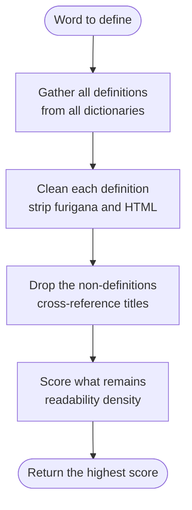

# CompreDef — Dictionary Picker Algorithm

## The problem

A learner looking up a word in a Japanese–Japanese dictionary gets a
definition written with words and kanji they have not learned yet —
which sends them looking up *those* words, forever (the **infinite
lookup loop**).

Children's dictionaries use simple language but don't cover advanced
terms. No single dictionary fits a learner at every level.

## The idea

CompreDef owns several dictionaries. For each word it:

1. Collects **every** definition from **every** dictionary.
2. Scores how much of each definition the learner can already read.
3. Returns the most readable one.

Every definition is ranked with the **same logic**, no matter which
dictionary it came from. Dictionary order never decides anything.



---

## Step 1 — What the learner knows

Once per session, CompreDef scans the learner's mature Anki notes
(cards reviewed for a full year or more, `interval ≥ 365`) and records
two things:

- **Kanji points** — one number per kanji.
- **Vocab points** — one number per multi-kanji compound
  (e.g. 公平, 会社). Kana-only words are skipped: kana inflects
  (やめる vs やめて), so matching whole kana words is unreliable.

Only the **first field** of each note counts (the word itself).
Definitions and examples never count — otherwise CompreDef's own
output would mark unknown kanji as known.

Each item earns mastery points from its best card interval:

$$
\mathrm{point}(x) = \min\left(1,\ \frac{\mathrm{interval}(x)}{365}\right)
$$

- Unknown item: $0$.
- One-year interval: the full $1.0$.
- Half a year: $0.5$.

So knowledge is not known/unknown — it is a number between 0 and 1
per kanji and per compound.

---

## Step 2 — Gather the definitions

Every installed dictionary is asked for the word — local dictionaries
through the SQLite index, optionally the Yomitan browser bridge.
A dictionary with no entry simply contributes nothing. A missing word
yields no candidates at all (never an error, never a freeze).

---

## Step 3 — Clean the text

Dictionary entries are rich HTML (ruby furigana, styling). Before
scoring, each definition is reduced to **scoring text** in three
passes. Display keeps the full HTML untouched — only the scoring
copy is cleaned.

- **Drop the boilerplate.** Thesaurus sections (`類語` synonym
  chains) and part-of-speech tags (〘名〙 and friends) are identified
  by their HTML markers and removed. A 20-synonym list says nothing
  about how readable the explanation is — scoring it rewards and
  punishes noise. Only tagged blocks are stripped; plain-text labels
  without tags are accepted noise (bounded, documented).
- **Strip the markup.** Remove `<rt>` / `<rp>` furigana readings,
  all remaining HTML tags, unescape entities (`&lt;` → `<`).
  Furigana must never pollute the score: the reading ま above 先 is a
  hint for display, not a kanji the learner needs to know.
- **Remove the headword.** The defined word itself is deleted before
  counting. The learner looked the word up precisely because it is
  unknown — its self-mentions (headers included) earn nothing. Only
  multi-character terms are removed (excluding a single kanji would
  wipe a common character everywhere).

---

## Step 4 — Drop the non-definitions

Some dictionary entries are not definitions at all. Two shapes occur:

- **Cross-reference titles** — a bare headword pointing elsewhere,
  e.g. an entry for 参照 whose whole content is `会社更生法`.
  No explanation, no sentence, just a title.
- **Child-entry lists** — several headwords joined by pipes, e.g.
  `(子) 会社員 | 会社組合 | …`. A list of words, not prose.

Why drop them: every kanji in a short title can be known, so a title
scores ~1.0 and beats the genuine explanation (this really happened
with 会社). Real prose always ends in 。？！ — anything with
sentence-ending punctuation is never dropped.

Exception: if a title is the *only* candidate, it is kept. A poor
definition beats no definition.

---

## Step 5 — The score, in detail

For one definition $D$, write:

- $K(D)$ — its kanji, counted **with repetition**
  (a kanji appearing 3 times counts 3 times).
- $W(D)$ — its **distinct** multi-kanji compounds.

Compounds are found without a morphological analyzer: maximal runs
of kanji characters, length 2 or more (MeCab is an explicit
non-goal — heavy native dependency, version drift). Runs split at
any kana or punctuation, so okurigana inflections (偏る → 偏) stay
out of vocab by construction, and synonyms glued by ・ split
correctly. Adjacent compounds with no separator at all can glue
(rare in prose; synonym lists are stripped first). Deterministic on
every machine.

### Kanji density

The fraction of the definition's kanji the learner knows:

$$
\mathrm{kanji\_density}(D) = \frac{\sum_{k \in K(D)} \mathrm{point}(k)}{|K(D)|}
$$

A definition with 10 kanji, 9 fully known: $9 / 10 = 0.9$.

### Vocab density

The fraction of the definition's compounds the learner knows:

$$
\mathrm{vocab\_density}(D) = \frac{\sum_{w \in W(D)} \mathrm{point}(w)}{|W(D)|}
$$

A definition using 4 compounds, 3 fully known: $3 / 4 = 0.75$.
A definition with no compounds at all scores $0$ here (nothing to
judge — not a penalty, just no signal).

### The score

$$
\mathrm{score}(D) = \mathrm{kanji\_density}(D) + \mathrm{vocab\_density}(D)
$$

One number between 0 and 2. The definition with the highest score
wins.

Two deliberate properties:

- **Kana = known (first approximation).** Kana length never punishes a
  definition. A kana-only definition scores neutral $0$ — it never
  wins on merit, so a kana gloss can't beat real prose, but a
  kana-heavy explanation of known kanji is not penalized either.
- **Density, not mass.** Raw point sums grow with length, so a
  20-paragraph 5%-known definition always beat a succinct 90%-known
  one. Dividing by length measures the fraction the learner can
  actually read. (The old raw-sum ranking survives as `LegacySumPicker`
  for comparison via the `picker_strategy` config key.)

---

## Step 6 — Ranking

Best first:

1. Highest $\mathrm{score}(D)$.
2. Tie-break: **most kanji**.

Exact ties keep encounter order, so a fixed input always yields the
same winner.

---

## Worked example — making the sausage, step by step

Word **不公平**, 4 definitions, one learner: the repo owner, whose
snapshot holds **1379 kanji and 1310 compounds** (totals only — the
full lists live in the Learner Knowledge dialog, not here).

### Step 0 — the raw material

The four stored definitions, exactly as parsed. Not human-readable — that is the point: everything below this section is what scoring starts from.

<details><summary>デジタル大辞泉 — stored HTML (75 bytes, click to expand)</summary>

```html
ふ‐こうへい【不公平】<br>［名・形動］公平でないこと。片寄りがあること。また、そのさま。「不公平な扱いを受ける」<br>[派生]ふこうへいさ［名］
```

</details>

<details><summary>三省堂国語辞典　第八版 — stored HTML (1678 bytes, click to expand)</summary>

```html
<span class="structured-content"><span class="gloss-sc-span" data-sc-name="見出部"><span class="gloss-sc-span" data-sc-name="見出仮名" style="font-weight: bold">ふ<span class="gloss-sc-span" data-sc-name="語構成" style="margin-right: 0.5em"></span>こ<span class="gloss-sc-span" data-sc-name="アクセント"><span class="gloss-sc-span" style="vertical-align: text-bottom"></span></span>うへい</span><span class="gloss-sc-span" data-sc-name="表記G">［<span class="gloss-sc-span" data-sc-name="表記"><span class="gloss-sc-span" data-sc-name="教育漢字">不公平</span></span>］</span><span class="gloss-sc-span" data-sc-name="品詞G"><span class="gloss-sc-span" data-sc-name="品詞subG">｟<span class="gloss-sc-span" data-sc-name="品詞">名</span>・<span class="gloss-sc-span" data-sc-name="品詞"><span class="gloss-sc-span" data-sc-name="割書">ダナ</span></span>｠</span></span></span><div class="gloss-sc-div" data-sc-name="解説部"><div class="gloss-sc-div" data-sc-name="大語義"><div class="gloss-sc-div" data-sc-name="語義"><span class="gloss-sc-span" data-sc-name="語釈">あつかいが平等でないこと。</span><span class="gloss-sc-span" data-sc-name="対義語G">（↔<span class="gloss-sc-span" data-sc-name="対義語subG"><span class="gloss-sc-span" data-sc-name="対義語">公平</span></span>）</span></div></div><div class="gloss-sc-div" data-sc-name="派生語G"><span class="gloss-sc-span" style="vertical-align: text-bottom; margin-right: 0.25em"></span><span class="gloss-sc-span" data-sc-name="派生語"><span class="gloss-sc-span" data-sc-name="派生語見出"><span class="gloss-sc-span" data-sc-name="派生語省略">不公平</span>さ</span>。</span></div></div></span>
```

</details>

<details><summary>大辞泉 第二版 — stored HTML (6184 bytes, click to expand)</summary>

```html
<span class="structured-content"><span class="gloss-sc-span" data-sc-html="" data-sc-lang="ja" data-sc-hmhtml="2" data-sc-xmlns="http://www.w3.org/1999/xhtml"><span class="gloss-sc-span" data-sc-body=""><div class="gloss-sc-div" data-sc-contents="" data-sc-xmlns=""><div class="gloss-sc-div" data-sc-見出g=""><span class="gloss-sc-span" data-sc-headword="" data-sc-見出="" data-sc-class="見出"><span class="gloss-sc-span">ふ</span><span class="gloss-sc-span" data-sc-hhyphen=""><span class="gloss-sc-span" data-sc-span="" data-sc-style="glyph:9769;"><span class="gloss-sc-span">‐</span></span></span><span class="gloss-sc-span">こうへい</span></span><span class="gloss-sc-span" data-sc-headword="" data-sc-表記="" data-sc-class="表記"><span class="gloss-sc-span">【不公平】</span></span><div class="gloss-sc-div" data-sc-maccentaudiog=""><span class="gloss-sc-span" data-sc-a="" data-sc-href="$c-accent"><span class="gloss-sc-span" data-sc-補足ロゴg=""><span class="gloss-sc-span" data-sc-補足ロゴ=""><span class="gloss-sc-span">アクセント</span></span></span></span><span class="gloss-sc-span"> ふこ</span><span class="gloss-sc-span" data-sc-maccentm=""><span class="gloss-sc-span">↓</span></span><span class="gloss-sc-span">うへい </span><span class="gloss-sc-span" data-sc-a="" data-sc-href="s00034429.aac"><span class="gloss-sc-span" data-sc-img="" data-sc-audio="" data-sc-class="audio" data-sc-src="Audio.png"></span></span></div></div><div class="gloss-sc-div" data-sc-解説g=""><div class="gloss-sc-div" data-sc-mg="" data-sc-id=""><div class="gloss-sc-div" data-sc-meaning=""><span class="gloss-sc-span" data-sc-hinshi="" data-sc-fm="" data-sc-class="FM"><span class="gloss-sc-span">〘</span><span class="gloss-sc-span" data-sc-a="" data-sc-href="$hi"><span class="gloss-sc-span">名・形動</span></span><span class="gloss-sc-span">〙</span></span><span class="gloss-sc-span">公平でないこと。片寄りがあること。また、そのさま。</span><span class="gloss-sc-span" data-sc-exg="" data-sc-id="319066-5001"><span class="gloss-sc-span">「―な扱いを受ける」</span></span></div></div><div class="gloss-sc-div" data-sc-mg="" data-sc-id=""><div class="gloss-sc-div" data-sc-meaning="" data-sc-c="" data-sc-class="C"><span class="gloss-sc-span" data-sc-a="" data-sc-href="$c-hasei"><span class="gloss-sc-span" data-sc-補足ロゴg=""><span class="gloss-sc-span" data-sc-補足ロゴ=""><span class="gloss-sc-span">派生</span></span></span></span><span class="gloss-sc-span"> </span><span class="gloss-sc-span" data-sc-bold=""><span class="gloss-sc-span">ふこうへいさ</span></span><span class="gloss-sc-span" data-sc-hinshi="" data-sc-bm="" data-sc-class="BM"><span class="gloss-sc-span">〘</span><span class="gloss-sc-span" data-sc-a="" data-sc-href="$hi"><span class="gloss-sc-span">名</span></span><span class="gloss-sc-span">〙</span></span></div><div class="gloss-sc-div" data-sc-meaning="" data-sc-c="" data-sc-class="C"><span class="gloss-sc-span" data-sc-a="" data-sc-href="$c-ruigo"><span class="gloss-sc-span" data-sc-補足ロゴg=""><span class="gloss-sc-span" data-sc-補足ロゴ=""><span class="gloss-sc-span">類語</span></span></span></span><span class="gloss-sc-span"> </span><a class="gloss-sc-a" href="?query=先入観&amp;wildcards=off"><span class="gloss-sc-span">先入観</span></a><span class="gloss-sc-span">・</span><a class="gloss-sc-a" href="?query=先入主&amp;wildcards=off"><span class="gloss-sc-span">先入主</span></a><span class="gloss-sc-span">・</span><a class="gloss-sc-a" href="?query=先入見&amp;wildcards=off"><span class="gloss-sc-span">先入見</span></a><span class="gloss-sc-span">・</span><a class="gloss-sc-a" href="?query=僻目&amp;wildcards=off"><span class="gloss-sc-span">僻目</span><span class="gloss-sc-span" data-sc-wari=""><span class="gloss-sc-span">ひがめ</span></span></a><span class="gloss-sc-span">・</span><a class="gloss-sc-a" href="?query=贔屓目&amp;wildcards=off"><span class="gloss-sc-span">贔屓目</span><span class="gloss-sc-span" data-sc-wari=""><span class="gloss-sc-span">ひいきめ</span></span></a><span class="gloss-sc-span">・</span><a class="gloss-sc-a" href="?query=欲目&amp;wildcards=off"><span class="gloss-sc-span">欲目</span></a><span class="gloss-sc-span">・</span><a class="gloss-sc-a" href="?query=固定観念&amp;wildcards=off"><span class="gloss-sc-span">固定観念</span></a><span class="gloss-sc-span">・</span><a class="gloss-sc-a" href="?query=偏る&amp;wildcards=off"><span class="gloss-sc-span">偏る</span></a><span class="gloss-sc-span">・</span><a class="gloss-sc-a" href="?query=不平等&amp;wildcards=off"><span class="gloss-sc-span">不平等</span></a><span class="gloss-sc-span">・</span><a class="gloss-sc-a" href="?query=偏る&amp;wildcards=off"><span class="gloss-sc-span">偏る</span></a><span class="gloss-sc-span">・</span><a class="gloss-sc-a" href="?query=偏する&amp;wildcards=off"><span class="gloss-sc-span">偏する</span></a><span class="gloss-sc-span">・</span><a class="gloss-sc-a" href="?query=偏向&amp;wildcards=off"><span class="gloss-sc-span">偏向</span></a><span class="gloss-sc-span">・</span><a class="gloss-sc-a" href="?query=僻する&amp;wildcards=off"><span class="gloss-sc-span">僻する</span></a><span class="gloss-sc-span">・</span><a class="gloss-sc-a" href="?query=偏見&amp;wildcards=off"><span class="gloss-sc-span">偏見</span></a><span class="gloss-sc-span">・</span><a class="gloss-sc-a" href="?query=偏在&amp;wildcards=off"><span class="gloss-sc-span">偏在</span></a><span class="gloss-sc-span">・</span><a class="gloss-sc-a" href="?query=偏重&amp;wildcards=off"><span class="gloss-sc-span">偏重</span></a><span class="gloss-sc-span">・</span><a class="gloss-sc-a" href="?query=偏頗&amp;wildcards=off"><span class="gloss-sc-span">偏頗</span><span class="gloss-sc-span" data-sc-wari=""><span class="gloss-sc-span">へんぱ</span></span></a><span class="gloss-sc-span">・</span><a class="gloss-sc-a" href="?query=差別&amp;wildcards=off"><span class="gloss-sc-span">差別</span></a><span class="gloss-sc-span">・</span><a class="gloss-sc-a" href="?query=片手落ち&amp;wildcards=off"><span class="gloss-sc-span">片手落ち</span></a><span class="gloss-sc-span">・</span><a class="gloss-sc-a" href="?query=バイアス&amp;wildcards=off"><span class="gloss-sc-span">バイアス</span></a><span class="gloss-sc-span">・</span><a class="gloss-sc-a" href="?query=アンフェア&amp;wildcards=off"><span class="gloss-sc-span">アンフェア</span></a></div></div></div></div></span></span></span>
```

</details>

<details><summary>小学館例解学習国語 第十二版 — stored HTML (4528 bytes, click to expand)</summary>

```html
<span class="structured-content"><span class="gloss-sc-span" data-sc-html="" data-sc-hmhtml="5" data-sc-lang="ja" data-sc-xmlns="http://www.w3.org/1999/xhtml"><span class="gloss-sc-span" data-sc-body=""><div class="gloss-sc-div" data-sc-dic-item="" data-sc-dic_item="" data-sc-id="30055" data-sc-xmlns=""><div class="gloss-sc-div" data-sc-head2=""><span class="gloss-sc-span" data-sc-headword="" data-sc-rank="" data-sc-class="rank"><span class="gloss-sc-span" data-sc-rank="" data-sc-em="" data-sc-class="em"><span class="gloss-sc-span" data-sc-rank-num="" data-sc-rank_num=""><span class="gloss-sc-span">５</span></span></span><span class="gloss-sc-span" data-sc-em=""><span class="gloss-sc-span">ふこうへい</span></span></span><span class="gloss-sc-span" data-sc-headword="" data-sc-標準表記="" data-sc-class="標準表記"><span class="gloss-sc-span" data-sc-paren=""><span class="gloss-sc-span">【</span></span><ruby class="gloss-sc-ruby" data-sc-ruby=""><span class="gloss-sc-span" data-sc-rb=""><span class="gloss-sc-span">不</span></span><rt class="gloss-sc-rt" data-sc-rt=""><span class="gloss-sc-span">４</span></rt></ruby><ruby class="gloss-sc-ruby" data-sc-ruby=""><span class="gloss-sc-span" data-sc-rb=""><span class="gloss-sc-span">公</span></span><rt class="gloss-sc-rt" data-sc-rt=""><span class="gloss-sc-span">２</span></rt></ruby><ruby class="gloss-sc-ruby" data-sc-ruby=""><span class="gloss-sc-span" data-sc-rb=""><span class="gloss-sc-span">平</span></span><rt class="gloss-sc-rt" data-sc-rt=""><span class="gloss-sc-span">３</span></rt></ruby><span class="gloss-sc-span" data-sc-paren=""><span class="gloss-sc-span">】</span></span></span><span class="gloss-sc-span" data-sc-posg=""><span class="gloss-sc-span"> </span><span class="gloss-sc-span" data-sc-pos="" data-sc-href="appendix/050_記号一覧.html#名・形動だな"><span class="gloss-sc-span" data-sc-ws=""><span class="gloss-sc-span">名・形動だな</span></span><span class="gloss-sc-span"> </span></span><span class="gloss-sc-span" data-sc-acc=""><span class="gloss-sc-span">フ</span><span class="gloss-sc-span" data-sc-b=""><span class="gloss-sc-span">コ</span></span><span class="gloss-sc-span">ーヘー</span></span></span></div><div class="gloss-sc-div" data-sc-div="" data-sc-main="" data-sc-class="main"><div class="gloss-sc-div" data-sc-meaning="" data-sc-id="30055-F001"><ruby class="gloss-sc-ruby" data-sc-ruby=""><span class="gloss-sc-span" data-sc-rb=""><span class="gloss-sc-span">公</span></span><rt class="gloss-sc-rt" data-sc-rt=""><span class="gloss-sc-span">こう</span></rt></ruby><ruby class="gloss-sc-ruby" data-sc-ruby=""><span class="gloss-sc-span" data-sc-rb=""><span class="gloss-sc-span">平</span></span><rt class="gloss-sc-rt" data-sc-rt=""><span class="gloss-sc-span">へい</span></rt></ruby><span class="gloss-sc-span">でないこと。えこひいきがあること。</span><a class="gloss-sc-a" href="?query=【例解】付録：記号一覧&amp;wildcards=off"><span class="gloss-sc-span" data-sc-bc="" data-sc-gray="" data-sc-class="gray" data-sc-alt="［例］"><span class="gloss-sc-span">例</span></span></a><span class="gloss-sc-span"> </span><span class="gloss-sc-span" data-sc-ex="" data-sc-id="30055-5001"><span class="gloss-sc-span" data-sc-b=""><span class="gloss-sc-span">不公平な</span></span><ruby class="gloss-sc-ruby" data-sc-ruby=""><span class="gloss-sc-span" data-sc-rb=""><span class="gloss-sc-span">判</span></span><rt class="gloss-sc-rt" data-sc-rt=""><span class="gloss-sc-span">はん</span></rt></ruby><ruby class="gloss-sc-ruby" data-sc-ruby=""><span class="gloss-sc-span" data-sc-rb=""><span class="gloss-sc-span">定</span></span><rt class="gloss-sc-rt" data-sc-rt=""><span class="gloss-sc-span">てい</span></rt></ruby><span class="gloss-sc-span">。</span></span><a class="gloss-sc-a" href="?query=【例解】付録：記号一覧&amp;wildcards=off"><span class="gloss-sc-span" data-sc-bs="" data-sc-blue="" data-sc-class="blue" data-sc-alt="［対］"><span class="gloss-sc-span">対</span></span></a><span class="gloss-sc-span"> </span><span class="gloss-sc-span" data-sc-ref=""><a class="gloss-sc-a" href="?query=公平&amp;wildcards=off"><ruby class="gloss-sc-ruby" data-sc-ruby=""><span class="gloss-sc-span" data-sc-rb=""><span class="gloss-sc-span">公</span></span><rt class="gloss-sc-rt" data-sc-rt=""><span class="gloss-sc-span">こう</span></rt></ruby><ruby class="gloss-sc-ruby" data-sc-ruby=""><span class="gloss-sc-span" data-sc-rb=""><span class="gloss-sc-span">平</span></span><rt class="gloss-sc-rt" data-sc-rt=""><span class="gloss-sc-span">へい</span></rt></ruby></a></span><span class="gloss-sc-span">。</span></div></div></div></span></span></span>
```

</details>

---

### Pass 1 — from stored HTML to scoring text

One definition travels three micro-steps before a single kanji is
counted. All three live in `scoring.py` and are combined by
`scoring_base_text` (which `score_definition` calls first). Display
is never touched — the Anki card keeps the full HTML from Step 0.

**Micro-step 1a — drop the boilerplate**
(`strip_scoring_boilerplate`). A parser from Python's standard
`html.parser` library walks the HTML tag by tag, keeping a stack of
open elements. It drops exactly two shapes: the thesaurus section
(the element carrying `data-sc-href="$c-ruigo"`, plus its whole
enclosing `<div>`) and part-of-speech tags (any element carrying
`data-sc-hinshi`). Everything without these markers passes through
byte-identical, and if parsing ever surprises, the input is returned
unchanged — scoring degrades to un-stripped, never to empty.
Here only 大辞泉 has tagged boilerplate; the other three pass
through untouched. 三省堂's ｟名・ダナ｠ looks like a POS tag but
carries no HTML markers (plain text), so it survives — accepted
noise, documented below.

**Micro-step 1b — base text** (`extract_base_text` in `utils.py`).
Three regex passes: first delete `<rt>`/`<rp>` elements (furigana
readings — e.g. 小学館's header ruby 不[4]公[2]平[3] contributes the
kanji 不公平 but its readings ４２３ must not), then delete all
remaining tags, then unescape entities. What remains is plain
readable text.

**Micro-step 1c — remove the headword** (`remove_excluded_terms`).
Plain substring deletion of the defined word 不公平 from the base
text. The learner looked the word up because it is unknown, so its
self-mentions (headers included) earn nothing. Only multi-character
terms are deleted — excluding a single kanji would wipe a common
character everywhere.

Raw base text first, then what cleaning removes:

- **三省堂国語辞典** (39 chars): no boilerplate. Headword 不公平
  appears twice (［不公平］ header, 不公平さ) → removed. Left:
  `ふこうへい［］｟名・ダナ｠あつかいが平等でないこと。（↔公平）さ。`
  (33 chars).
  **Result:** 39 → 33 chars, 11 → 5 kanji counted.
- **小学館例解学習国語** (57 chars): no boilerplate. Headword
  twice (【不公平】 header, 不公平な判定) → removed. (51 chars)
  **Result:** 57 → 51 chars, 17 → 11 kanji counted.
- **デジタル大辞泉** (67 chars): no boilerplate. Headword twice
  (【不公平】 header, 不公平な扱い) → removed. (61 chars)
  **Result:** 67 → 61 chars, 18 → 12 kanji counted.
- **大辞泉 第二版** (168 chars): the 類語 block goes first — 93
  characters of synonym links (先入観・贔屓目・偏見・偏頗 …),
  including 5 kanji the learner does **not** know (**偏**, **僻**,
  **屓**, **贔**, **頗**) and 15 unknown compounds (the block's only
  known compound is 不平等). Then the headword (【不公平】 header)
  → removed. Left: 72 characters of actual explanation.
  **Result:** 168 → 72 chars, 59 → 12 kanji counted.

What stays: 三省堂's plain-text POS tag ｟名・ダナ｠ has no HTML
markers, so its 名 survives as scoring input (known — harmless,
documented noise).

### Pass 2 — kanji view: type each definition, highlight what is known

How: `score_definition` in `scoring.py` runs the regex
`[\u4e00-\u9fff]` over the Pass-1 scoring text and finds every kanji
occurrence. Each one is looked up in the learner's kanji points
(`point(k)`, Step 1 — 1.0 for a year-old interval, 0 for unknown)
and the points are summed. Same cleaned text as Pass 1, typed here a
first time with every **known** kanji highlighted and every
**unknown** kanji bold. Kana and
punctuation stay plain — they are never scored.

**三省堂国語辞典** — 5 occurrences, all known → $5/5 = 1.0$:

> ふこうへい［］｟<mark>名</mark>・ダナ｠あつかいが<mark>平</mark><mark>等</mark>でないこと。（↔<mark>公</mark><mark>平</mark>）さ。

**小学館例解学習国語** — 11 occurrences, all known → $11/11 = 1.0$:

> ５ふこうへい【】 <mark>名</mark>・<mark>形</mark><mark>動</mark>だな フコーヘー<mark>公</mark><mark>平</mark>でないこと。えこひいきがあること。<mark>例</mark> な<mark>判</mark><mark>定</mark>。<mark>対</mark> <mark>公</mark><mark>平</mark>。

**デジタル大辞泉** — 12 occurrences, all known → $12/12 = 1.0$:

> ふ‐こうへい【】［<mark>名</mark>・<mark>形</mark><mark>動</mark>］<mark>公</mark><mark>平</mark>でないこと。<mark>片</mark><mark>寄</mark>りがあること。また、そのさま。「な<mark>扱</mark>いを<mark>受</mark>ける」[<mark>派</mark><mark>生</mark>]ふこうへいさ［<mark>名</mark>］

**大辞泉 第二版** — 12 occurrences, all known → $12/12 = 1.0$:

> ふ‐こうへい【】アクセント ふこ↓うへい <mark>名</mark>・<mark>形</mark><mark>動</mark>〙<mark>公</mark><mark>平</mark>でないこと。<mark>片</mark><mark>寄</mark>りがあること。また、そのさま。「―な<mark>扱</mark>いを<mark>受</mark>ける」<mark>派</mark><mark>生</mark> ふこうへいさ<mark>名</mark>〙

Nobody has an unknown kanji left — the cleaning pass deleted every
one, so every kanji lights up. Kanji alone cannot separate these
four; the decision moves to compounds entirely.

### Pass 3 — compound view: type each definition again, highlight the words

How: `extract_kanji_words` in `scoring.py` runs one regex pass that
collects maximal runs of 2+ kanji (会社, 不公平) — no dictionary, no
network, no MeCab; runs split at any kana or punctuation, which is
also why okurigana inflections (偏る → 偏) never pollute vocab.
Each distinct run is looked up in the learner's vocab points and the
points are summed; a definition with no runs scores 0 here (no
signal, not a penalty). Same text typed a second time, now with
every **known compound** highlighted and every **unknown** compound
bold. Single kanji stay
plain here — they already had their turn in Pass 2; only
multi-kanji runs score as words.

**三省堂国語辞典** — ✓公平, ✓平等 → $2/2 = 1.0$:

> ふこうへい［］｟名・ダナ｠あつかいが<mark>平等</mark>でないこと。（↔<mark>公平</mark>）さ。

**小学館例解学習国語** — ✓公平 | ✗判定, ✗形動 → $1/3 = 0.333$:

> ５ふこうへい【】 名・**形動**だな フコーヘー<mark>公平</mark>でないこと。えこひいきがあること。例 な**判定**。対 <mark>公平</mark>。

**デジタル大辞泉** — ✓公平 | ✗形動, ✗派生, ✗片寄 → $1/4 = 0.25$:

> ふ‐こうへい【】［名・**形動**］<mark>公平</mark>でないこと。**片寄**りがあること。また、そのさま。「な扱いを受ける」[**派生**]ふこうへいさ［名］

**大辞泉 第二版** — ✓公平 | ✗形動, ✗派生, ✗片寄 → $1/4 = 0.25$:

> ふ‐こうへい【】アクセント ふこ↓うへい 名・**形動**〙<mark>公平</mark>でないこと。**片寄**りがあること。また、そのさま。「―な扱いを受ける」**派生** ふこうへいさ名〙

### Pass 4 — score and rank

How: `DensityPicker.rank_key` in `picker.py` turns each result into
the pair `(-density, -kanji_count)` and Python's stable sort orders
lowest first — so the highest score wins, then the most kanji, and
exact ties keep encounter order. `pick_best` walks the same keys in
one pass, which is why the ranked list and the generated pick can
never disagree.

| dictionary | kanji | vocab | **score** |
|---|---|---|---|
| 三省堂国語辞典 | $5/5 = 1.0$ | $2/2 = 1.0$ | **2.0** ★ |
| 小学館例解学習国語 | $11/11 = 1.0$ | $1/3 = 0.333$ | 1.333 |
| デジタル大辞泉 | $12/12 = 1.0$ | $1/4 = 0.25$ | 1.25 |
| 大辞泉 第二版 | $12/12 = 1.0$ | $1/4 = 0.25$ | 1.25 |

**Result:** 三省堂 wins outright at 2.0. デジタル大辞泉 and 大辞泉
tie exactly (1.25, 12 kanji each) — encounter order keeps デジタル
(the earlier candidate) ahead of 大辞泉.

三省堂 wins because it is the only definition whose every compound
is known. Under the old raw sums 大辞泉 won with 49 points of
known-kanji mass while being the least readable of the four — that
flip is the v1.3 change, and you can reproduce every number above
with `python3 debug/audit_picker.py --html`.

---

## Swapping the method

Everything above lives in the self-contained `picker.py` (it depends
only on `scoring` / `models` / `utils` — never on providers, Anki, or
Qt). A new picking idea subclasses `PickerStrategy` — one method,
`rank_key` — and becomes active via `get_active_strategy()` or the
`picker_strategy` config key. No other module changes.

---

## 2. SQLite-Cached Dictionary Indexing

CompreDef uses **SQLite caching** for dictionary lookups instead of
pickle files, providing faster B-tree lookups with zero RAM footprint.

### Dictionary Sources

CompreDef supports both:

- **Unzipped Directories**: Contains `term_bank_*.json` files and
  `index.json` metadata.
- **ZIP Archives**: Yomitan `.zip` dictionaries loaded directly from
  compressed archives (zero-disk footprint, instant access).

### SQLite Database Structure

The cache database (`user_files/cache/dictionaries.db`) contains:

- `dictionaries` table: Stores dictionary path, title, signature, and
  entry count.
- `entries` table: Maps `(dict_path, term)` to rich HTML definitions.

### Cache Invalidation

- **Signature**: Computed from dictionary source (file modification
  times and sizes for folders, mtime + size for ZIPs), with the
  renderer version embedded (a renderer change invalidates every
  index).
- **Update Trigger**: Dictionaries are indexed ONCE at install time
  via the GUI; generation is pure SQLite lookups and never parses
  files. When dictionary files change, the signature updates,
  triggering re-indexing on explicit reinstall.
- **Performance**: Lookups are instant indexed B-tree queries; a
  lookup never triggers indexing (verified by
  `test_lookup_never_indexes`).

### Yomitan HTML Rendering

CompreDef renders faithful Yomitan structured-content:

- **Ruby Furigana**: `<ruby>` tags with `<rt>` readings preserved for
  Anki display.
- **Data Attributes**: `data-sc-*` attributes for accessibility and
  tooling.
- **Inline CSS**: Yomitan's `style` field converted to inline CSS
  (e.g., `fontSize: 14em` becomes `font-size: 14em`).
- **Special Tags**: `<data-sc-name="用例">` for example sentences.
- **Rich Elements**: `<span class="gloss-sc-span">`,
  `<div class="gloss-sc-div">`, table cells with `colSpan`/`rowSpan`.
- **Output**: Full HTML with all styling and semantics for direct
  insertion into Anki note fields.

---

## 3. Database Safety Mandate

In strict accordance with Anki development standards:

- **No Direct SQLite Connections**: External sqlite3 connections to
  `collection.anki2` can cause database corruption and SQLite locks.
  CompreDef exclusively accesses the database through Anki's native
  Python wrapper: `mw.col.db.all()`.
- **Non-Blocking Background Threads**: All dictionary searches,
  scoring calculations, and database scans execute asynchronously
  using `mw.taskman.run_in_background()` with a completion callback
  to the main thread.

---

## 4. Regression Testing Mandate

The fundamental regression suite lives at `tests/test_regression.py`
(plus isolated Ring 0 units at `tests/test_units.py`) and **must be
run green before every commit**
(`python3 tests/test_units.py && python3 tests/test_regression.py`).
Each test maps to a real historical bug:

| Historical bug | Guarding test |
|---|---|
| Plain-text definitions (121 chars) served instead of rich Yomitan HTML (~7000 chars) | `test_structured_content_html_fidelity` + real-dictionary `先ず` smoke test |
| Renderer upgraded but SQLite cache kept serving stale plain text forever | `test_renderer_version_invalidates_cache` (verifies `RENDERER_VERSION` is embedded in signatures) |
| Furigana `<rt>` readings polluted the kanji comprehension score | `test_scoring_ignores_furigana` |
| An advanced dictionary won despite a simpler readable definition existing | `test_order_independent_argmax` (pins order-independent argmax) |
| Raw-sum scoring favored 20-paragraph 5%-known definitions over succinct 90%-known ones | `test_v12_scoring_algorithm` §7 + `test_picker_audit_strict` (density ordering over the real-deck fixture) |
| Cross-reference titles ("see also") won over real definitions | `test_reference_title_filtering` |
| ZIP archive and unzipped folder produced different output | `test_zip_folder_parity` |
| `data-sc-*` attributes drifted from Yomitan's DOM naming (breaking the user's CSS compactor) | `test_data_sc_attribute_names` |
| Nonsense word `駿ってさ` froze Anki at 100% CPU and crashed it | `test_nonsense_word_returns_none_fast` |
| Indexing accumulated ~1.3 GB of rendered HTML in RAM (OOM freeze on giant dictionaries like 大辞泉) | `test_indexing_streams_in_batches` (verifies bounded `_INDEX_BATCH_SIZE` + streamed commits) |
| SQLite connections never closed (`with conn:` commits but does not close), leaking a handle per lookup | `test_db_connections_are_closed` |
| Renderer upgrade left duplicate/orphan rows behind | `test_renderer_upgrade_reindexes_cleanly` |

The suite stubs `aqt` so it runs on both system Python and Anki's
bundled Python without Anki installed. Smoke tests against the real
installed dictionaries self-skip when those dictionaries are absent.

## 5. On-Demand Debugging

Beyond the per-commit suite, `debug/` holds the learner-knowledge
snapshot spec (SP1–SP7), use cases (U1–U5), copy-paste Debug Console
recipes for the live collection (`console_snippets.md`), a standalone
sanity script (`python3 debug/sanity_knowledge.py`), and the
dictionary-picker audit
(`python3 debug/audit_picker.py --capture --html`, fixture at
`tests/fixtures/picker_audit.json`) — all deliberately **not** run by
CI except through their frozen fixtures.
