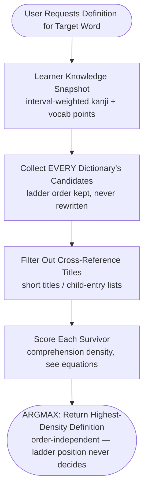

# CompreDef Wiki - Algorithm & Architecture Specification

## Overview

CompreDef is designed around Stephen Krashen's **$i+1$ Comprehensible Input Hypothesis**: language acquisition occurs most effectively when learners are exposed to messages that are slightly beyond their current level, but still almost entirely comprehensible.

Traditional Japanese-Japanese (国語) dictionaries (like 大辞林, 大辞泉, or 広辞苑) frequently define target words using obscure literary vocabulary or unlearned kanji. For a beginner or intermediate learner, looking up a word in such a dictionary creates an infinite lookup loop. Conversely, children's dictionaries (like 例解学習国語) provide simpler explanations using elementary kanji and grammar, but lack coverage of advanced terms.

CompreDef solves this deterministically through the **Dictionary Ladder with Comprehension-Density Scoring**.

---
## 1. The Algorithm



There is no early exit: with weighted scores, a dictionary-order
fluke must never beat a strictly better definition (the 不公平 case —
see worked example). The ladder order decides *where to look*, the
score decides *what wins*.

### Step-by-Step Execution

1. **Learner Knowledge (The Kanji Matrix)**:
   - The add-on queries Anki's native database wrapper (`mw.col.db` —
   never a raw sqlite3 connection) for mature notes inside the user's
   Scope decks:
     ```sql
     SELECT notes.flds, MAX(cards.ivl) FROM notes
     JOIN cards ON cards.nid = notes.id
     WHERE cards.ivl >= 365 AND cards.did IN (<scope>)
     GROUP BY notes.id
     ```
   - Mature = a card interval ≥ 365 days (one full year). Only the
   FIRST field of each note counts (never definitions or examples —
   CompreDef's own output must not mark unknown kanji known).
   - Each kanji / multi-kanji compound earns mastery points:
     $$\mathrm{point}(x) = \min\left(1, \frac{\mathrm{max\_interval}(x)}{365}\right),\quad 0 \text{ when unknown}$$
     A year-old interval is full mastery (1.0); younger intervals count
     proportionally. Kana-only words earn nothing (inflection-hostile:
     やめる vs やめて); single kanji are covered by kanji points, so
     vocab points track multi-kanji compounds only.

2. **Candidate Collection (The Dictionary Ladder)**:
   - The user orders dictionaries top-to-bottom (richest readable
   first); every dictionary contributes its entries for the word
   (local SQLite index via `lookup_by_path`, or the Yomitan bridge
   slices). Uninstalled/disabled dictionaries are skipped; a missing
   word simply yields no candidates.

3. **HTML Processing for Scoring**:
   - Before scoring, definitions are reduced to **base text** for
   comprehension scoring:
     - Strip all `<rt>` (furigana) and `<rp>` tags.
     - Remove remaining HTML tags.
     - Unescape HTML entities.
   - Furigana readings never pollute kanji scores; the full rich HTML
   (ruby, `data-sc-*`) is preserved for Anki display.

4. **Candidate Filtering**:
   - Short cross-reference headwords (e.g., `"会社更生法"`) and
   pipe-separated child-entry lists (`会社員 | 会社組合 | …`) are not
   readable definitions and are dropped — unless they are the ONLY
   candidate, in which case the lone entry is still allowed. Real
   prose always ends in 。？！ and is never filtered.

5. **Comprehension-Density Scoring (v1.3)**:
   - For a definition $D$, let $K(D)$ be its kanji occurrences
   ($|K|$ = kanji_count) and $W(D)$ its distinct multi-kanji
   compounds. The single decision metric is:
     $$\mathrm{kanji\_density}(D) = \frac{\sum_{k \in K(D)} \mathrm{point}(k)}{|K(D)|} \in [0,1]$$
     $$\mathrm{vocab\_density}(D) = \frac{\sum_{w \in W(D)} \mathrm{point}(w)}{|W(D)|} \in [0,1]\quad (0 \text{ when } W = \emptyset)$$
     $$\mathrm{score}(D) = \mathrm{kanji\_density}(D) + \mathrm{vocab\_density}(D)$$
   - **Kana = known (first approximation).** Kana length never punishes
   a definition; kana-only definitions ($|K| = 0$) score neutral 0 —
   they never win on merit, so a kana gloss can't beat real prose, but
   a kana-heavy explanation of known kanji is not penalized either.
   - Why density, not raw sums: raw sums grow with length, so a
   20-paragraph 5%-known definition always beat a succinct 90%-known
   one. Density measures the *fraction the learner can actually read*.
   (The v1.2 raw-sum ranking survives as `LegacySumPicker` for A/B via
   the `picker_strategy` config key.)

6. **Ranking (strict total order, best first)**:
   1. highest $\mathrm{score}(D)$,
   2. tie-break: most kanji (richer prose),
   3. tie-break: dictionary title, then definition text.
   - Keys 2–3 use input *properties*, never input positions, so
   shuffling the ladder can never change the winner
   (order-independence). Given $N$ definitions and one learner there
   is exactly one correct ordering.

7. **Swapping the method**: everything above lives in the
   self-contained `picker.py` (depends only on
   `scoring`/`models`/`utils`). A new picking idea subclasses
   `PickerStrategy` (one method: `rank_key`) and becomes active via
   `get_active_strategy()` / the `picker_strategy` config key —
   no other module changes.

### Worked example (real data, learner = repo owner)

Word 不公平, 4 local candidates, learner knows 1379 kanji / 1310 compounds:

| dictionary | raw sum (old) | kanji | **score = density (new)** | picked? |
|---|---|---|---|---|
| 大辞泉 第二版 | 49.0 | 59 | 0.9225 | — (longest, least readable fraction) |
| デジタル大辞泉 | 20.0 | 18 | 1.4000 | — |
| 小学館例解学習国語 | 19.0 | 17 | 1.5000 | — |
| 三省堂国語辞典 | 14.0 | 11 | **2.0000** | ★ (every kanji + compound known) |

Raw sums crown 大辞泉 (49.0); density crowns 三省堂 (2.0 = 1.0 kanji
+ 1.0 vocab — the whole definition is readable). That flip *is* the
v1.3 change.

---

## 2. SQLite-Cached Dictionary Indexing

CompreDef now uses **SQLite caching** for dictionary lookups instead of pickle files, providing faster B-tree lookups with zero RAM footprint.

### Dictionary Sources

CompreDef supports both:
- **Unzipped Directories**: Contains `term_bank_*.json` files and `index.json` metadata.
- **ZIP Archives**: Yomitan `.zip` dictionaries loaded directly from compressed archives (zero-disk footprint, instant access).

### SQLite Database Structure

The cache database (`user_files/cache/dictionaries.db`) contains:
- `dictionaries` table: Stores dictionary path, title, signature, and entry count.
- `entries` table: Maps `(dict_path, term)` to rich HTML definitions.

### Cache Invalidation

- **Signature**: Computed from dictionary source (file modification times and sizes for folders, mtime + size for ZIPs), with the renderer version embedded (a renderer change invalidates every index).
- **Update Trigger**: Dictionaries are indexed ONCE at install time via the GUI; generation is pure SQLite lookups and never parses files. When dictionary files change, the signature updates, triggering re-indexing on explicit reinstall.
- **Performance**: Lookups are instant indexed B-tree queries; a lookup never triggers indexing (verified by `test_lookup_never_indexes`).

### Yomitan HTML Rendering

CompreDef renders 100% faithful Yomitan structured-content:
- **Ruby Furigana**: `<ruby>` tags with `<rt>` readings preserved for Anki display.
- **Data Attributes**: `data-sc-*` attributes for accessibility and tooling.
- **Inline CSS**: Yomitan's `style` field converted to inline CSS (e.g., `fontSize: 14em` becomes `font-size: 14em`).
- **Special Tags**: `<data-sc-name="用例">` for example sentences.
- **Rich Elements**: `<span class="gloss-sc-span">`, `<div class="gloss-sc-div">`, table cells with `colSpan`/`rowSpan`.
- **Output**: Full HTML with all styling and semantics for direct insertion into Anki note fields.

---

## 3. Database Safety Mandate

In strict accordance with Anki development standards:
- **No Direct SQLite Connections**: External sqlite3 connections to `collection.anki2` can cause database corruption and SQLite locks. CompreDef exclusively accesses the database through Anki's native Python wrapper: `mw.col.db.all()`.
- **Non-Blocking Background Threads**: All dictionary searches, scoring calculations, and database scans execute asynchronously using `mw.taskman.run_in_background()` with a completion callback to the main thread.

---

## 4. Regression Testing Mandate

The fundamental regression suite lives at `tests/test_regression.py` (plus isolated Ring 0 units at `tests/test_units.py`) and **must be run green before every commit** (`python3 tests/test_units.py && python3 tests/test_regression.py`). Each test maps to a real historical bug:

| Historical bug | Guarding test |
|---|---|
| Plain-text definitions (121 chars) served instead of rich Yomitan HTML (~7000 chars) | `test_structured_content_html_fidelity` + real-dictionary `先ず` smoke test |
| Renderer upgraded but SQLite cache kept serving stale plain text forever | `test_renderer_version_invalidates_cache` (verifies `RENDERER_VERSION` is embedded in signatures) |
| Furigana `<rt>` readings polluted the kanji comprehension score | `test_scoring_ignores_furigana` |
| Ladder fell through to an advanced dictionary despite a simpler comprehensible definition | `test_ladder_early_exit_order` (now pins order-independent argmax) |
| Raw-sum scoring favored 20-paragraph 5%-known definitions over succinct 90%-known ones | `test_v12_scoring_algorithm` §7 + `test_picker_audit_strict` (density ordering over the real-deck fixture) |
| Cross-reference titles ("see also") won over real definitions | `test_reference_title_filtering` |
| ZIP archive and unzipped folder produced different output | `test_zip_folder_parity` |
| `data-sc-*` attributes drifted from Yomitan's DOM naming (breaking the user's CSS compactor) | `test_data_sc_attribute_names` |
| Nonsense word `駿ってさ` froze Anki at 100% CPU and crashed it | `test_nonsense_word_returns_none_fast` |
| Indexing accumulated ~1.3 GB of rendered HTML in RAM (OOM freeze on giant dictionaries like 大辞泉) | `test_indexing_streams_in_batches` (verifies bounded `_INDEX_BATCH_SIZE` + streamed commits) |
| SQLite connections never closed (`with conn:` commits but does not close), leaking a handle per lookup | `test_db_connections_are_closed` |
| Renderer upgrade left duplicate/orphan rows behind | `test_renderer_upgrade_reindexes_cleanly` |

The suite stubs `aqt` so it runs on both system Python and Anki's bundled Python without Anki installed. Smoke tests against the real installed dictionaries self-skip when those dictionaries are absent.

## 5. On-Demand Debugging

Beyond the per-commit suite, `debug/` holds the learner-knowledge
snapshot spec (SP1–SP7), use cases (U1–U5), copy-paste Debug Console
recipes for the live collection (`console_snippets.md`), a standalone
sanity script (`python3 debug/sanity_knowledge.py`), and the
dictionary-picker audit (`python3 debug/audit_picker.py --capture
--html`, fixture at `tests/fixtures/picker_audit.json`) — all
deliberately **not** run by CI except through their frozen fixtures.
