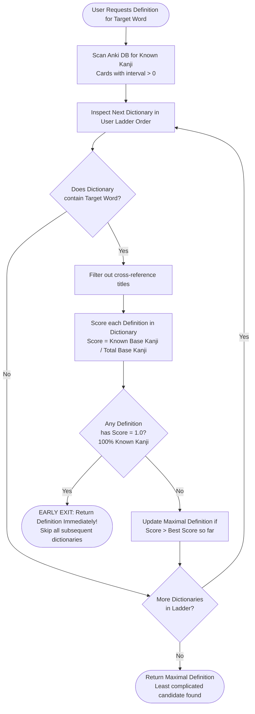

# CompreDef Wiki - Algorithm & Architecture Specification

## Overview

CompreDef is designed around Stephen Krashen's **$i+1$ Comprehensible Input Hypothesis**: language acquisition occurs most effectively when learners are exposed to messages that are slightly beyond their current level, but still almost entirely comprehensible.

Traditional Japanese-Japanese (国語) dictionaries (like 大辞林, 大辞泉, or 広辞苑) frequently define target words using obscure literary vocabulary or unlearned kanji. For a beginner or intermediate learner, looking up a word in such a dictionary creates an infinite lookup loop. Conversely, children's dictionaries (like 例解学習国語) provide simpler explanations using elementary kanji and grammar, but lack coverage of advanced terms.

CompreDef solves this deterministically through the **Dictionary Ladder with Early Exit & Kanji Matrix Scoring**.

---

## 1. The Algorithm



### Step-by-Step Execution

1. **Known Kanji Extraction (The Kanji Matrix)**:
   - The add-on queries Anki's native database:
     ```sql
     SELECT DISTINCT notes.id, notes.flds
     FROM notes
     JOIN cards ON notes.id = cards.nid
     WHERE cards.ivl > 0
     ```
   - Only cards with `interval > 0` are analyzed (ensuring only reviewed/retained material is counted as "known").
   - A compiled C-level regular expression `[\u4e00-\u9fff]` extracts all kanji from the field blobs in **0.18 seconds** across 60,000+ card rows.
   - The result is a set $\mathcal{K}_{\text{known}}$ of all kanji the learner currently knows.

2. **The Dictionary Ladder Traversal**:
   - The user arranges their installed dictionaries in any order they prefer — order is a *preference*, not a difficulty rating:
     1. **Recommended top rung**: the richest dictionary the user can comfortably read (e.g., 三省堂国語辞典) — its definitions win whenever they pass the comprehension gate.
     2. **Fallback rungs**: progressively simpler dictionaries (e.g., 小学館例解学習国語) that catch words the richer sources explain with too-difficult kanji.
   - The generator iterates through this ladder **one dictionary at a time**.

3. **HTML Processing for Scoring**:
   - Before scoring, definitions are processed to extract **base text** for comprehension scoring:
     - Strip all `<rt>` (furigana) and `<rp>` tags.
     - Remove remaining HTML tags.
     - Unescape HTML entities.
   - This ensures only base kanji are counted for the Kanji Matrix Scoring, while the full rich HTML with furigana is preserved for Anki display.

4. **Candidate Filtering**:
   - Short cross-reference headwords (e.g., `"会社更生法"`, `"参照"`) that do not contain sentence punctuation (`。`, `、`) are filtered out so that real explanatory sentences are always selected.

5. **Kanji Comprehension Scoring**:
   - For every candidate definition HTML string $D$, let $K(D)$ be the multiset of kanji characters appearing in $D$ (base text only, no furigana).
   - The comprehension score $S(D)$ is calculated as:
     $$S(D) = \begin{cases} 1.0 & \text{if } |K(D)| = 0 \\ \frac{\sum_{c \in K(D)} [c \in \mathcal{K}_{\text{known}}]}{|K(D)|} & \text{if } |K(D)| > 0 \end{cases}$$
   - Pure hiragana/katakana definitions have $S(D) = 1.0$ (fully readable).

6. **Early Exit (Short-Circuit Evaluation)**:
   - If a definition yields $S(D) = 1.0$ (100% of the kanji are known):
     - **The loop immediately halts and returns that definition.**
     - Dictionaries further down the ladder are **never queried**.
     - **Benefits**:
       - *Comprehension-tailored*: The learner receives the preferred (top-of-ladder) dictionary's definition whenever they can fully read it, and falls back to simpler rungs exactly when they cannot. Since $S(D)$ measures kanji only — kana words are not checked — the ladder order is the user's control for stylistic difficulty.
       - *Computational*: Avoiding further lookups keeps execution time at **0.05 seconds**.

7. **The Maximal Fallback**:
   - If no dictionary in the entire ladder yields a 100% match, the algorithm returns the candidate definition with the highest comprehension score $S(D)$ found across all evaluated dictionaries.
   - This fallback is **order-independent**: every dictionary contributes its best candidate, and the highest score wins regardless of ladder position.
   - This ensures the learner always receives the **least complicated definition available**.

---

## 2. SQLite-Cached Dictionary Indexing

CompreDef now uses **SQLite caching** for dictionary lookups instead of pickle files, providing faster B-tree lookups with zero RAM footprint.

### Dictionary Sources

CompreDef supports both:
- **Unzipped Directories**: Contains `term_bank_*.json` files and `index.json` metadata.
- **ZIP Archives**: Yomitan `.zip` dictionaries loaded directly from compressed archives (zero-disk footprint, instant access).

### SQLite Database Structure

The cache database (`user_files/cache/dictionaries.db`) contains:
- `dictionaries` table: Stores dictionary path, title, signature, and entry count.
- `entries` table: Maps `(dict_path, term)` to rich HTML definitions.

### Cache Invalidation

- **Signature**: Computed from dictionary source (file modification times and sizes for folders, mtime + size for ZIPs).
- **Update Trigger**: When dictionary files change, the signature updates, triggering re-indexing.
- **Performance**: First lookup (~0.5s) indexes the dictionary; subsequent lookups are **instant (0.08ms)** via indexed B-tree queries.

### Yomitan HTML Rendering

CompreDef renders 100% faithful Yomitan structured-content:
- **Ruby Furigana**: `<ruby>` tags with `<rt>` readings preserved for Anki display.
- **Data Attributes**: `data-sc-*` attributes for accessibility and tooling.
- **Inline CSS**: Yomitan's `style` field converted to inline CSS (e.g., `fontSize: 14em` becomes `font-size: 14em`).
- **Special Tags**: `<data-sc-name="用例">` for example sentences.
- **Rich Elements**: `<span class="gloss-sc-span">`, `<div class="gloss-sc-div">`, table cells with `colSpan`/`rowSpan`.
- **Output**: Full HTML with all styling and semantics for direct insertion into Anki note fields.

---

## 3. Database Safety Mandate

In strict accordance with Anki development standards:
- **No Direct SQLite Connections**: External sqlite3 connections to `collection.anki2` can cause database corruption and SQLite locks. CompreDef exclusively accesses the database through Anki's native Python wrapper: `mw.col.db.all()`.
- **Non-Blocking Background Threads**: All dictionary searches, scoring calculations, and database scans execute asynchronously using `mw.taskman.run_in_background()` with a completion callback to the main thread.

---

## 4. Regression Testing Mandate

The fundamental regression suite lives at `tests/test_regression.py` and **must be run green before every commit** (`python3 tests/test_regression.py`). Each test maps to a real historical bug:

| Historical bug | Guarding test |
|---|---|
| Plain-text definitions (121 chars) served instead of rich Yomitan HTML (~7000 chars) | `test_structured_content_html_fidelity` + real-dictionary `先ず` smoke test |
| Renderer upgraded but SQLite cache kept serving stale plain text forever | `test_renderer_version_invalidates_cache` (verifies `RENDERER_VERSION` is embedded in signatures) |
| Furigana `<rt>` readings polluted the kanji comprehension score | `test_scoring_ignores_furigana` |
| Ladder fell through to an advanced dictionary despite a simpler comprehensible definition | `test_ladder_early_exit_order` |
| Cross-reference titles ("see also") won over real definitions | `test_reference_title_filtering` |
| ZIP archive and unzipped folder produced different output | `test_zip_folder_parity` |
| `data-sc-*` attributes drifted from Yomitan's DOM naming (breaking the user's CSS compactor) | `test_data_sc_attribute_names` |
| Nonsense word `駿ってさ` froze Anki at 100% CPU and crashed it | `test_nonsense_word_returns_none_fast` |
| Indexing accumulated ~1.3 GB of rendered HTML in RAM (OOM freeze on giant dictionaries like 大辞泉) | `test_indexing_streams_in_batches` (verifies bounded `_INDEX_BATCH_SIZE` + streamed commits) |
| SQLite connections never closed (`with conn:` commits but does not close), leaking a handle per lookup | `test_db_connections_are_closed` |
| Renderer upgrade left duplicate/orphan rows behind | `test_renderer_upgrade_reindexes_cleanly` |

The suite stubs `aqt` so it runs on both system Python and Anki's bundled Python without Anki installed. Smoke tests against the real installed dictionaries self-skip when those dictionaries are absent.

## 5. On-Demand Debugging

Beyond the per-commit suite, `debug/` holds the learner-knowledge
snapshot spec (SP1–SP6), use cases (U1–U5), copy-paste Debug Console
recipes for the live collection (`console_snippets.md`), and a
standalone sanity script (`python3 debug/sanity_knowledge.py`) that is
deliberately **not** run by CI — it is for triage when something looks
wrong (e.g. 0 known kanji after an Anki upgrade).
